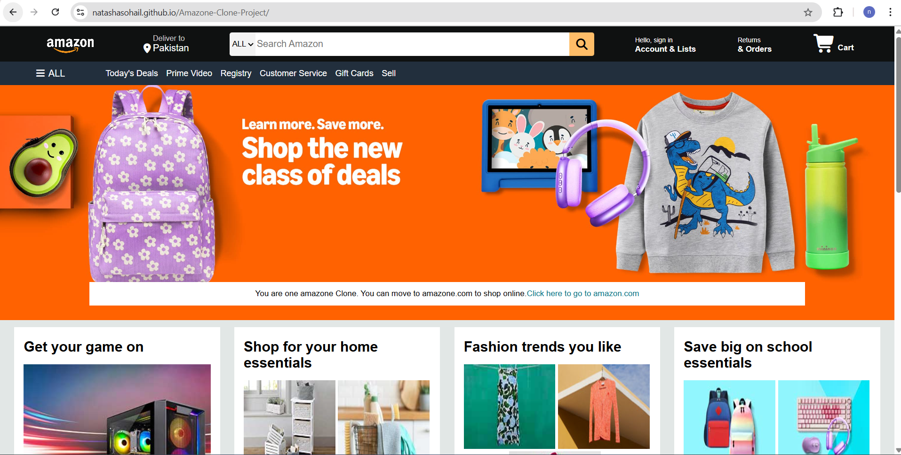

# 🛒 Amazon Clone (HTML & CSS)

#### A static **Amazon.com** homepage clone created with **pure HTML and CSS**.  
#### This project is built **for educational purposes only** to practice HTML structure and CSS styling — **no backend, interactivity, or commercial use**.
---
## ⚠️ Disclaimer
### This project is a <b>non-commercial, educational imitation </b> of Amazon's website.  
### It is <b>not affiliated with, endorsed by, or connected to Amazon.com, Inc.</b> in any way. 
### All trademarks, product names, and brand logos used remain the property of their respective owners.

---
## 🚀 Features
- **Static layout** inspired by Amazon's homepage
- **Pure HTML and CSS** without frameworks
- **Hover effects** for interactive styling
- **Clean, semantic HTML structure**
- **Product showcase section**

---
## 📸 Demo
 

https://natashasohail.github.io/Amazone-Clone-Project/
---

## 🛠️ Technologies Used
- **HTML5** – Semantic markup for structure
- **CSS3** – Styling and hover effects
- **Flexbox** – Basic layout alignment
---
## 📂 Folder Structure
Amazon-Clone-Project/ 
│ 
├── README.md 
├── index.html 
├── style.css 
├── images/ 
&nbsp;&nbsp;&nbsp;&nbsp;&nbsp;&nbsp;&nbsp;&nbsp;&nbsp;&nbsp;└── All images used in imitating the web page.

